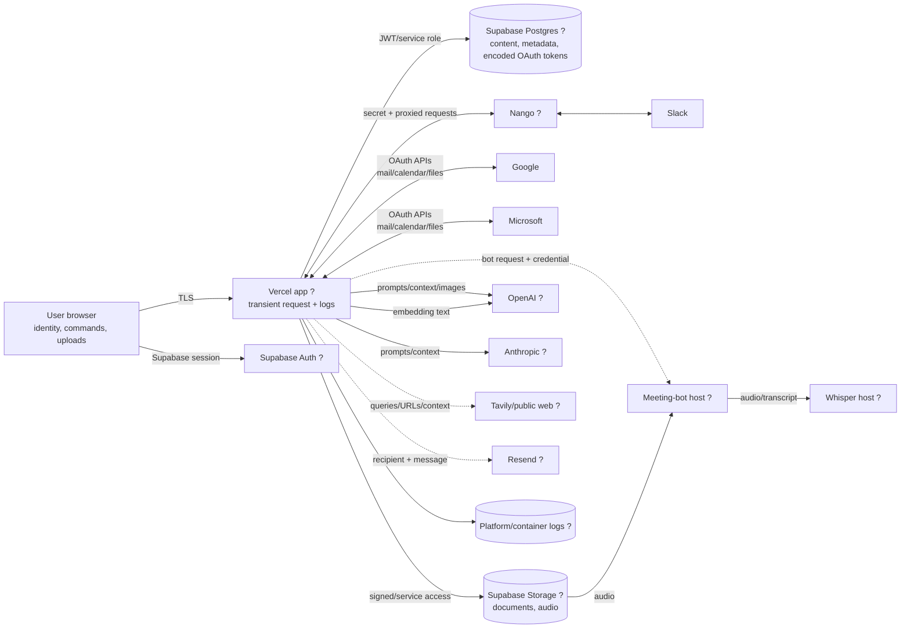
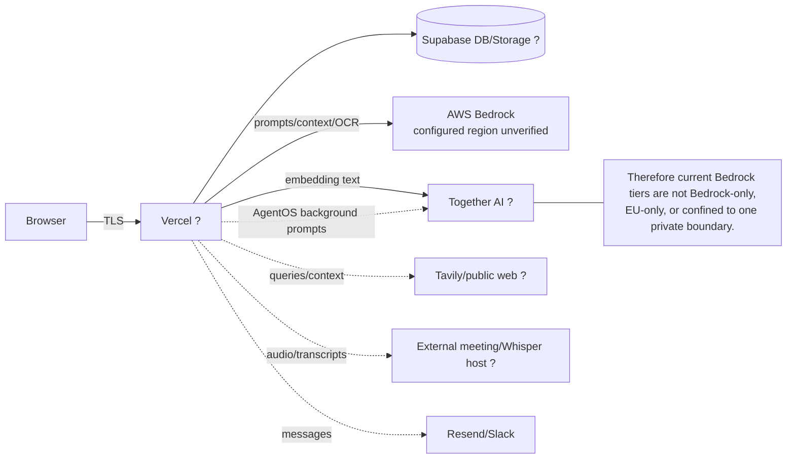
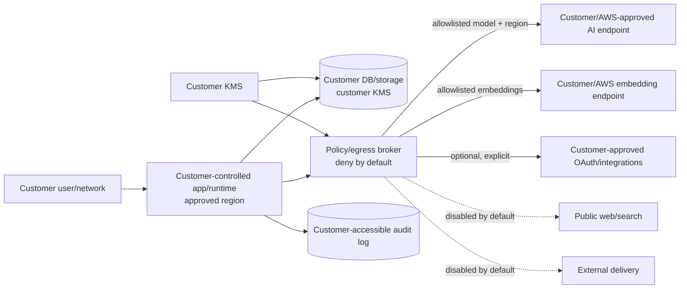

# AUGMTD security, privacy, and product-consistency remediation plan

**Audit date:** 23 July 2026  
**Scope:** repository implementation and checked-in configuration, using `AUGMTD_CANONICAL_PRODUCT_KNOWLEDGE_BASE.md` as the baseline  
**Method:** static architecture and code-path review. No product code, infrastructure, database, or production configuration was changed.  
**Confidence rule:** “production” is used only where deployment can be established from code or configuration. Vercel, Supabase, AWS, Nango, provider, backup, DPA, and logging console settings remain **unverified** unless explicitly stated.

## 1. Executive summary

AUGMTD should not broaden customer rollout until five immediate boundary failures are addressed:

1. A late database migration grants every authenticated user execution rights on a `SECURITY DEFINER` account-deletion function that accepts an arbitrary user ID. If this migration is live, an authenticated user may be able to delete another user’s data. The same migration exposes a storage-object enumeration helper. This is a **P0 / critical** production-state verification and remediation item.
2. Gmail and Microsoft access and refresh tokens are Base64-encoded, not cryptographically encrypted. They are stored inside `connections.metadata.tokens`, readable by service-role clients and database operators/backups. There is no application-level key rotation.
3. Gmail and Outlook reconnect OAuth state is unsigned, has no server-side nonce, and the callback trusts `stateData.userId` while writing through a service-role client. This creates an account-linking integrity risk.
4. A browser storage-state file containing credential-like Google session material is tracked in Git and mounted into the meeting-bot runtime. It must be treated as a credential incident. Separately, checked local configuration points meeting-bot/transcription traffic at non-TLS endpoints; those paths carry audio, internal bearer credentials, and in some cases a Google access token.
5. “Private,” “Bedrock,” “EU,” “on-prem,” and “no third-party AI” claims are not enforceable properties of the current routing architecture. Bedrock tiers use Together AI for embeddings; AgentOS uses Together AI for several tasks; web tools call Tavily and arbitrary sites; private/OpenAI-compatible and Azure clients can default to public OpenAI behavior when endpoint configuration is missing.

The main P1 themes are fail-closed workspace processing policy, tenant/service-role containment, reliable deletion, unified standing-approval semantics, an embedding reindex, meeting consent, and completion of the `projects` to `work_entities` cutover. P2 work should establish security audit logs, metric integrity, a real integration truth registry, narrow API/CORS classes, and generated documentation checks.

No repository evidence establishes production Bedrock region, Supabase/Vercel/storage regions, CloudWatch model-invocation logging, backup expiry, KMS configuration, VPC endpoints, DPAs, provider retention settings, or current customer contracts. These are not negative findings; they are facts that must remain **unverified** until console and contractual evidence is collected.

### Immediate containment checklist

Before the larger program begins:

- Inspect live PostgreSQL function ACLs and definitions for `delete_user_account(uuid)` and `get_user_storage_objects(uuid)`; revoke `authenticated` and `PUBLIC` immediately if present.
- Disable or guard Gmail/Outlook reconnect callbacks until signed, single-use state is deployed.
- Rotate/revoke the tracked Google browser session and related bot credentials; preserve evidence, assess repository access, then purge the artifact from current and historical Git.
- Disable externally reachable non-TLS meeting-bot and transcription endpoints; rotate their bearer and Supabase service-role credentials.
- Freeze new “private,” “EU-only,” “air-gapped,” “no external AI,” “nothing sends automatically,” and “deletion within 30 days” claims.
- Inventory and, where practical, rotate all stored Gmail/Microsoft refresh tokens after encrypted storage is available.

## 2. Top ten risks

| Rank | Priority / severity | Finding | Customer impact | Rollout blocker |
|---:|---|---|---|---|
| 1 | P0 / critical | Authenticated execution grant on arbitrary-user `SECURITY DEFINER` deletion RPC | Possible cross-user destructive deletion if the migration is live | Yes |
| 2 | P0 / critical | Tracked Google browser session state used by meeting bot | Account/session takeover and meeting access; repository-history exposure | Yes |
| 3 | P0 / critical | OAuth tokens are encoded, not encrypted | Database/service-role/backup compromise exposes long-lived mailbox and calendar access | Yes |
| 4 | P0 / critical | Unsigned OAuth state trusted by service-role callback | Cross-account connection injection or corruption | Yes |
| 5 | P0 / critical (configuration-dependent) | Meeting-bot/transcription endpoints may use plaintext HTTP and receive bearer credentials, audio, and Google tokens | Network interception and broad service compromise | Yes |
| 6 | P0 / high | Restricted-tier provider routing fails open or crosses stated boundaries | Customer content can reach unapproved AI/search/embedding providers | Yes for restricted deployments |
| 7 | P1 / high | Deletion/disconnect is partial, non-transactional, and does not prove backup/provider expiry | Orphaned data, active upstream grants, false deletion claims | Yes |
| 8 | P1 / high | Service-role usage is pervasive and inconsistently tenant-scoped | One missing filter can become cross-tenant exposure; external bot holds a broad key | Yes |
| 9 | P1 / high | External actions lack one enforceable approval model | AI/chat/schedules may message third parties under ambiguous authorization | Yes |
| 10 | P1 / high | Legacy project runtime remains after schema cutover | Production errors, lost associations, orphaned/duplicated context, unstable APIs | Yes |

## 3. P0 remediation plan

### P0-1 — Restrict destructive database functions

- **Problem:** `delete_user_account(uuid)` is a `SECURITY DEFINER` function accepting an arbitrary target. A later migration grants it to `authenticated`; no target-equals-caller check is present in the comprehensive definition. `get_user_storage_objects(uuid)` is granted similarly.
- **Current behavior:** application account deletion calls the RPC through service role, but the database privilege also permits direct authenticated RPC invocation if the migration is applied.
- **Risk:** cross-user deletion and storage-path disclosure. Supabase API exposure makes database function privileges part of the application attack surface.
- **Affected files/services:** `supabase/migrations/20260425_fix_delete_user_account_comprehensive.sql` (`delete_user_account`); `supabase/migrations/20260616_security_fixes.sql` (lines granting `authenticated`); Supabase PostgREST; `lib/workspace/cascade-delete.ts`; `app/api/user/delete/route.ts`.
- **Recommended fix:** immediately revoke both functions from `PUBLIC`, `anon`, and `authenticated`. Keep an internal function owned by a non-login role and executable only by a narrowly scoped backend role. If self-service deletion needs an RPC, expose a separate wrapper with no target parameter or enforce `target_user_id = auth.uid()`, fixed `search_path`, explicit schema qualification, and tests. Prefer a deletion job API over a large security-definer transaction.
- **Dependencies:** live database access; incident/security owner; database migration window.
- **Effort:** S for containment; M for safe redesign.
- **Tests:** query live `proacl`; direct anon/authenticated/service-role RPC tests; attempt deletion/enumeration of self and another fixture tenant; search-path injection test; application self-delete regression.
- **Migration/customer action:** database ACL migration required; no customer action. If misuse is found, incident response and affected-customer notification may be required.
- **Blocked claims:** “tenant isolated,” “customer data cannot be accessed by other customers,” “secure account deletion.”
- **Owner:** Security + Backend.

### P0-2 — KMS-backed OAuth token protection

- **Problem:** Gmail and Microsoft token blobs called `encryptedTokens` are only Base64 JSON. Base64 is reversible encoding.
- **Current behavior:** access/refresh tokens are written to `connections.metadata.tokens`; multiple mail, calendar, Drive, webhook, cron, picker, meeting-bot, and send paths decode the value and sometimes rewrite refreshed tokens. Service-role clients can read every row. Slack credentials are delegated to self-hosted Nango, whose actual encryption/key configuration is unverified. `tenant_configs.encrypted_api_keys` and `mcp_connections.encrypted_credentials` are names, not proof of encryption.
- **Risk:** a database dump, service-role leak, operator misuse, or backup exposure yields persistent mailbox/calendar access. Ad hoc refresh rewrites make rotation and audit difficult.
- **Affected files/services:** `app/api/auth/{gmail,outlook}/callback/route.ts`; `app/api/auth/gmail/picker-token/route.ts`; `lib/google/gmail.ts`; `lib/microsoft/outlook.ts`; `lib/calendar/*`; `lib/email-sync/sync-emails.ts`; inbox/compose/meeting routes; `connections.metadata`; `tenant_configs.encrypted_api_keys`; `mcp_connections.encrypted_credentials`; Nango.
- **Recommended fix:** introduce one credential broker. Store a versioned envelope:

  ```json
  {
    "v": 2,
    "alg": "AES-256-GCM",
    "kid": "kms-key-alias-or-version",
    "edk": "base64-kms-encrypted-data-key",
    "iv": "base64",
    "ct": "base64",
    "tag": "base64",
    "aad": {"env": "prod", "workspace": "uuid", "user": "uuid", "provider": "gmail"}
  }
  ```

  Generate a fresh data-encryption key per credential (or tightly bounded credential group), encrypt locally with AES-GCM, immediately discard plaintext key, and wrap it with AWS KMS or the approved customer KMS. Bind ciphertext to environment/workspace/user/provider through authenticated additional data. Put ciphertext in a dedicated `integration_credentials` table with no browser-readable policy; keep non-secret metadata in `connections`.

  The broker must be the only read/write/refresh path, return short-lived in-memory plaintext, redact errors, and emit metadata-only audit events. Use IAM roles and encryption-context conditions so only credential-broker workloads can decrypt the appropriate environment/workspace.

- **Backward-compatible migration:** recognize `v:2` first and legacy Base64 only behind a time-limited flag. On read, decrypt v2; for a legacy value, decode, validate expected token shape, encrypt to v2 transactionally, and remove legacy content. Run an idempotent batch migrator with `FOR UPDATE SKIP LOCKED`, status/checksum fields, retry queues, counts but no plaintext logs. Stop new legacy writes before batch migration.
- **Rotation:** support rewrap (KMS key rotation without plaintext re-encryption) and full re-encryption. Record `kid`, created/rotated timestamps, and reason. Separate dev/staging/prod keys and roles. For customer-controlled deployments, use a customer key/role and fail closed.
- **Failure recovery:** retain the previous envelope only in a restricted migration journal for a short, explicit window; never fall back to legacy after cutover. If decrypt fails, mark connection `reauth_required`, stop processing, alert, and never log the blob. Provider revocation/reconnect is safer than indefinite recovery copies.
- **Rollback:** rollback application code may read v2 via a compatibility library; do not restore plaintext columns. Pause migration and rewrap with the prior KMS key if key-policy errors occur.
- **Dependencies:** KMS/IAM/IaC, credential-table migration, broker refactor, provider reconnect UX, security logging.
- **Effort:** L.
- **Tests:** cryptographic known-answer/tamper/AAD tests; legacy-to-v2 migration; concurrent refresh; KMS denial/throttle/outage; wrong workspace/environment; rotation/rewrap; log scanning for token fragments; database dump assertion; revocation/reauth; service-role cannot select plaintext.
- **Migration/customer action:** server migration required. Customers only need action for corrupt/unrefreshable tokens or a deliberate global revocation.
- **Blocked claims:** “OAuth tokens are encrypted,” “credentials are protected with KMS,” “customer-controlled encryption,” “private deployment.”
- **Owner:** Security Platform + Integrations.

### P0-3 — Signed, single-use OAuth transaction state

- **Problem:** Gmail and Outlook state is Base64 JSON. Reconnect state contains a user ID; callbacks decode and trust it, then use service role to upsert credentials. Timestamp is not validated. No nonce, server-side transaction, signature, or callback-session binding exists.
- **Current behavior:** `/api/auth/{gmail,outlook}/connect` authenticates the initiating request, but callback authorization derives from attacker-modifiable state. Signup state and the `pending_oauth_connection` cookie are also encoded rather than signed, although finalization checks cookie user ID against the session.
- **Risk:** forged or replayed callbacks may attach an attacker-controlled provider account to a victim identifier, overwrite metadata, trigger sync into the wrong tenant, or confuse login/account resolution.
- **Affected files/services:** `app/api/auth/gmail/connect/route.ts`; `app/api/auth/outlook/connect/route.ts`; both callback routes; signup-connect routes; `app/api/auth/finalize-connection/route.ts`.
- **Recommended fix:** create a server-side `oauth_transactions` record containing a random 256-bit nonce hash, provider, authenticated user (nullable only for signup), exact redirect URI, PKCE verifier where supported, expiry, intended operation, and consumed timestamp. State should be an opaque random value or authenticated JWE/HMAC token; consume it atomically once. For reconnect, also require the current session and match it to the transaction. Do not accept a target user ID from callback input. Validate issuer/provider account uniqueness and explicit account-linking rules.
- **Dependencies:** short-lived store/database table; provider callback changes; signup/login flow tests.
- **Effort:** M.
- **Tests:** state tampering, victim-ID substitution, replay, expiry, provider swap, redirect mismatch, parallel tabs, session change, signup/reconnect confusion, account already linked elsewhere.
- **Migration/customer action:** no data migration; active OAuth attempts may need restarting at deployment.
- **Blocked claims:** “secure OAuth,” “connections are scoped to your account.”
- **Owner:** Identity + Integrations.

### P0-4 — Revoke tracked meeting-bot browser credential

- **Problem:** `infra/meeting-bot/google-auth.json` is tracked by Git and used as Playwright browser storage state. It contains credential-like Google session material. Repository history must be assumed to expose it to everyone with clone access.
- **Current behavior:** scripts create/copy this file, Docker mounts it read-only, and the bot loads it. `.gitignore` does not exclude it.
- **Risk:** Google account/session takeover, unauthorized meeting access, persistence in forks/caches/CI artifacts, and inability to prove credential custody.
- **Affected files/services:** `infra/meeting-bot/google-auth.json`; `infra/meeting-bot/save-google-auth.py`; `infra/meeting-bot/bot_runner.py`; `infra/hetzner/docker-compose.yml`; Git hosting and clones; Google account.
- **Recommended fix:** treat as an incident: revoke all Google sessions and tokens for the bot identity, rotate password/MFA/recovery credentials, review Google and repository access logs, preserve a restricted forensic copy, remove the file from the tip and history with coordinated clone invalidation, add secret/storage-state scanning and ignore rules. Replace shared browser state with a supported least-privilege meeting identity mechanism; if browser automation remains, fetch an encrypted, short-lived credential at runtime and isolate it per environment.
- **Dependencies:** Security incident lead, Google Workspace admin, Git hosting admin, meeting product owner.
- **Effort:** S containment; M replacement.
- **Tests:** repository-history secret scan; old session fails; runtime has no credential file in image/mount; least-privilege identity can join only approved meetings; no cookies in logs/artifacts.
- **Migration/customer action:** internal credential rotation; scheduled pilots may need rescheduling.
- **Blocked claims:** “secrets are never committed,” “meeting bot uses secure credentials,” “least privilege.”
- **Owner:** Security + Meeting Infrastructure.

### P0-5 — Secure meeting and transcription transport/credential boundary

- **Problem:** checked local configuration uses `http://` remote meeting-bot and Whisper URLs. Meeting-bot requests carry an internal bearer secret and, on some routes, the user’s Google OAuth access token; transcription sends audio. The external bot has a Supabase service-role credential.
- **Current behavior:** Node posts to `MEETING_BOT_SERVICE_URL` and `WHISPER_SERVICE_URL`; meeting-bot endpoints accept broad internal credentials and directly access Supabase. Whether production uses the same values is unverified.
- **Risk:** interception of mailbox tokens/audio/internal secrets; compromise of an Internet-facing bot yields database-wide service-role access; sensitive URLs/user IDs/storage paths enter container logs.
- **Affected files/services:** `.env.local` (values not reproduced); `lib/integrations/meeting-bot/{client,whisper-client,bot-manager}.ts`; meeting bot API/routes and `bot_runner.py`; `infra/hetzner/docker-compose.yml`; Supabase.
- **Recommended fix:** block production startup for non-HTTPS/non-private endpoints. Use private networking plus mTLS or TLS with pinned service identity, request signing, nonce/timestamp replay protection, narrow ingress, and rotated secrets. Never send mailbox OAuth tokens to the bot; give it a purpose-specific one-time join grant or use a dedicated bot identity. Replace service role with signed object URLs and narrowly scoped internal endpoints/DB role. Redact meeting URLs and identifiers from logs.
- **Dependencies:** networking/DNS/certificates; bot auth redesign; Supabase role/IAM design.
- **Effort:** L.
- **Tests:** TLS enforcement; expired/replayed signature; unauthorized ingress; packet/log secret scan; bot cannot enumerate tenants/storage; signed URL scope/expiry; audio deletion.
- **Migration/customer action:** infrastructure migration and credential rotation; pilot interruption possible.
- **Blocked claims:** “encrypted in transit,” “private meeting processing,” “least privilege,” “EU processing” until host region is evidenced.
- **Owner:** Infrastructure + Security + Meetings.

### P0-6 — Enforce a fail-closed workspace processing policy

- **Problem:** tier selection is a model-default map, not a complete data-egress policy. It does not govern embeddings, AgentOS, Tavily/web fetch, transcription, meeting bot, Resend, or arbitrary URLs as one boundary. Missing Azure or OpenAI-compatible base URLs can instantiate an OpenAI client with its public default. `getSystemClient` always uses standard-tier providers.
- **Current behavior:** Bedrock tiers send embeddings to Together AI. AgentOS `bedrock_optimised` sends planning/classification/summarization/assignment to Together. Private/on-prem endpoints are optional. Deep research and web tools call Tavily/public destinations. A no-user “system” client selects standard providers. Failures can fall back to native execution or a different task slot without an explicit workspace egress decision.
- **Risk:** restricted customer content crosses contractual/provider/region boundaries silently. Claims cannot be made or audited per run.
- **Affected files/services:** `lib/ai/{defaults,factory,bedrock-adapter}.ts`; `lib/work/agentos-bridge.ts`; `infra/agentos/models.py`; `lib/workflows/execute-step.ts`; `lib/tools/{deep-research,web-search,fetch-url,browser-fetch,rss-feed}.ts`; Whisper/meeting-bot/Resend tools; `tenant_configs`.
- **Recommended fix:** define a versioned `WorkspaceProcessingPolicy` evaluated before every egress:

  ```yaml
  policy_version: 1
  allowed_providers: [aws_bedrock]
  allowed_regions: [eu-central-1]
  allowed_model_profiles: [approved-profile-arns]
  embeddings: {provider: aws_bedrock, region: eu-central-1}
  transcription: {provider: customer_whisper, endpoint_id: approved-id}
  web_research: disabled
  external_destinations: []
  automatic_delivery: standing_grants_only
  fallback: fail_closed
  ```

  Resolve policy once per request/run, pass it through Node and AgentOS, and authorize every completion, embedding, OCR, transcription, search, URL fetch, and external write. Require explicit endpoints for Azure/private/on-prem, validate HTTPS/private address and hostname allowlists, and never inherit public provider keys. Record policy ID/provider/region/model/tool/destination and decision in an audit event without content. Startup and workspace activation must fail if required provider/region/endpoints are absent.
- **Dependencies:** policy schema/admin UI, centralized egress broker, AgentOS protocol change, embedding migration, inventory.
- **Effort:** XL.
- **Tests:** policy decision table; missing endpoint/key/region; public OpenAI SDK default prevention; AgentOS/native fallback; system-client calls; Tavily/URL/Resend/transcription denial; DNS rebinding/redirect; audit coverage; chaos/provider outage proves fail-closed.
- **Migration/customer action:** assign an explicit policy to every workspace; restricted customers must approve provider/destination allowlist and may need reindexing.
- **Blocked claims:** all private/EU/air-gapped/no-third-party/provider-exclusive claims.
- **Owner:** AI Platform + Security Architecture.

## 4. P1 remediation plan

### P1-1 — Explicit Bedrock/EU configuration and auditable invocation

- **Problem/current behavior:** Node factory defaults `AWS_BEDROCK_REGION` to `us-east-1`; AgentOS defaults differ; deep-research construction uses another regional default. Model IDs include EU inference-profile prefixes, but repository code does not prove actual production region, cross-region routing, CloudWatch model logging, KMS, VPC endpoints, IAM scope, or retention.
- **Risk:** unintended regional processing, startup with an invalid privacy posture, inconsistent execution by path, and unauditable invocations.
- **Files/services:** `lib/ai/factory.ts`; `lib/ai/bedrock-adapter.ts`; `lib/tools/deep-research.ts`; `infra/agentos/models.py`; local env (explicit EU value only, not production proof); AWS Bedrock/IAM/CloudTrail/CloudWatch/VPC.
- **Fix:** remove all region defaults in production; validate approved region and full inference-profile ARN/model allowlist at startup and workspace activation. Use IAM roles, region/model/resource conditions, SCPs where available, VPC endpoints, and explicit egress controls. Decide whether cross-region inference profiles are allowed; if not, use regional models supported in the approved region. Enable CloudTrail model invocation auditability. Keep model-invocation content logging disabled by default or send it to a dedicated KMS-encrypted, least-privilege log group with short declared retention and customer policy.
- **Dependencies:** P0 processing policy; AWS account/IaC access; model availability decision.
- **Effort:** M.
- **Tests:** startup matrix for missing/invalid region/model; IAM deny outside region/model; CloudTrail event correlation; logging redaction/retention; VPC endpoint and egress tests.
- **Migration/customer action:** deployment configuration migration; restricted customers must choose allowed region/cross-region stance.
- **Blocked claims:** “processed in the EU,” “EU-only,” “private Bedrock,” “customer data never leaves region.”
- **Owner:** Cloud Platform + Security.

### P1-2 — Bedrock/private embedding migration

- **Problem/current behavior:** `bedrock_private` and `bedrock_optimised` use Together `intfloat/multilingual-e5-large-instruct`. Standard uses OpenAI `text-embedding-3-small` truncated to 1,024 dimensions. `knowledge_files.embedding` and `knowledge_chunks.embedding` are `vector(1024)`; entity embeddings also exist. A provider/model change invalidates vector comparability.
- **Risk:** private-tier content leaves the Bedrock boundary; a one-step provider switch breaks semantic retrieval or requires destructive reindexing (a prior migration deleted chunks).
- **Files/services:** `lib/ai/defaults.ts`; `lib/knowledge/indexer.ts` (document/chunk/query embedding); entity recognition/context paths; migrations `20260312_knowledge_chunks_dim1024.sql`, `20260328_fix_search_knowledge_files_dim.sql`, `20260721_work_entities.sql`; Together/AWS.
- **Fix:** select an approved AWS Bedrock embedding model, AWS-hosted service, or customer endpoint based on language quality, dimension, EU availability, throughput, cost, and contract. Do not overwrite the current vector. Add `embedding_model`, `embedding_version`, and dual vector storage (new column/table with the new dimension), versioned search RPCs, and an index job. Dual-write new/changed content, backfill per workspace with resumable checkpoints, query both spaces and fuse normalized ranks, compare quality, then switch policy and retire old vectors/provider. Never compare vectors from different models directly.
- **Dependencies:** provider/model evaluation; P0 policy; capacity/cost; schema/index change.
- **Effort:** L.
- **Tests:** dimension/schema; deterministic version routing; dual-write; interrupted/restarted backfill; rank-fusion relevance suite; tenant isolation; old/new query compatibility; no Together call for restricted fixtures; rollback to old index.
- **Migration/customer action:** full restricted-workspace reindex. No customer action unless customer-controlled endpoint credentials are required. Duration/cost cannot be estimated without corpus size and provider quotas.
- **Blocked claims:** “Bedrock-only,” “no third-party AI provider sees customer work,” “customer-controlled processing.”
- **Owner:** Search/Knowledge + AI Platform.

### P1-3 — Coherent deletion, revocation, and backup expiry

- **Problem/current behavior:** Gmail/Outlook disconnect deletes the local connection but does not prove upstream revocation or push-watch/subscription cancellation. Nango disconnect swallows deletion failures. “Delete data” issues many independent deletes, ignores many errors, omits several product tables, can remove meeting inbox items beyond the selected connection, and leaves connections enabled so sync can repopulate data. Account/workspace deletion treats storage cleanup as non-fatal, does not cover external processors, and can continue after per-member failures. Backup expiry is absent from code.
- **Risk:** retained/orphaned/reingested data, active provider access, false completion responses, and inability to satisfy or evidence deletion requests.
- **Files/services:** `app/api/auth/{gmail,outlook}/disconnect/route.ts`; `app/api/integrations/[provider]/route.ts`; `lib/integrations/nango.ts`; `app/api/settings/delete-data/route.ts`; `lib/workspace/cascade-delete.ts`; `app/api/user/delete/route.ts`; Supabase DB/Auth/Storage/backups; provider APIs/logs.
- **Fix:** create a durable deletion request with scope, legal-hold status, enumerated resources/processors, idempotency key, per-step state, retry/dead-letter queue, and verification results. First disable sync and external writes; cancel watches/subscriptions; revoke OAuth/Nango grants; delete scoped DB/storage data; delete Auth when appropriate; dispatch processor deletions; record backup-expiry deadline rather than claiming immediate backup deletion; verify zero expected live objects and orphan queries; issue a completion receipt. Workspace deletion must not remove the workspace parent until every member/resource step succeeds or is explicitly quarantined.
- **Dependencies:** processor inventory/retention contracts; job runner; storage manifest; legal policy.
- **Effort:** XL.
- **Tests:** matrix in section 8; failure injection each step; retry/idempotency; reingestion prevention; orphan scans; audit receipt; backup restoration test proving logical tombstones; provider revocation.
- **Migration/customer action:** backfill deletion manifests/tombstones; customers may reauthenticate after disconnect-policy changes.
- **Blocked claims:** “deleted within 30 days,” “disconnect revokes access,” “all data is deleted,” GDPR erasure completeness.
- **Owner:** Privacy Engineering + Backend + Legal.

### P1-4 — Tenant isolation and service-role minimization

- **Problem/current behavior:** many routes/jobs create service-role clients. Boundaries are manually enforced with `user_id`/workspace filters. Meeting bot holds service role externally. Workspace resolution often uses `.maybeSingle()`, which is ambiguous for multi-workspace membership. Cron/webhook/workflow/knowledge/entity paths bypass RLS.
- **Risk:** a missing or incorrect filter becomes cross-tenant read/write; broad credential compromise has database-wide impact.
- **Files/services:** `lib/integrations/connection.ts`; `lib/ai/factory.ts`; `lib/context/*`; `lib/knowledge/*`; `lib/email-sync/*`; cron/webhook/workflow routes; meeting-bot infrastructure; platform-admin APIs.
- **Fix:** require an explicit `TenantContext {workspaceId,userId,actorId,role}` derived from authenticated membership or signed job payload. Never infer “the” workspace with `.maybeSingle()`. Create purpose-specific database roles/RPCs and tenant-scoped repositories; retain service role only in a small broker. Scope storage paths and signed URLs by workspace/user. Sign cron/webhook/job payloads, validate ownership before every object lookup, and add static/lint rules disallowing raw service-role clients outside approved modules.
- **Dependencies:** membership product decision; repository layer; RLS review; bot redesign.
- **Effort:** XL.
- **Tests:** cross-user/cross-workspace fixtures for every service-role route/job; multi-workspace membership; forged webhook/job; ID substitution; storage path traversal/listing; admin role boundaries; property tests requiring tenant predicates.
- **Migration/customer action:** workspace membership/data backfill may be needed; no normal customer action.
- **Blocked claims:** “strict tenant isolation,” “least privilege,” enterprise rollout.
- **Owner:** Backend Platform + Security.

### P1-5 — Product-wide approval and external-action authorization

- **Problem/current behavior:** approval is path-specific. User-click send/reply and work-plan gates exist, but chat can invoke `slack_post_message` directly; scheduled workflow tool steps execute `slack_send`, `send_calendar_invite`, and `forward_email`; report-back delivery can use Resend/Slack under configuration. There is no shared grant, recipient/destination bound, expiry, idempotency, or terminology.
- **Risk:** unintended communications, duplicate messages/invitations, reputational damage, and an inaccurate blanket approval promise.
- **Files/services:** `app/api/work/threads/[id]/chat/route.ts`; `lib/workflows/{execute-step,run-workflow}.ts`; `lib/tools/{slack,forward-email,send-calendar-invite,coworker-email}.ts`; compose/inbox/meeting routes; AgentOS tool route; workflow UI.
- **Fix:** implement centralized action authorization:
  - `prepare` never changes external state.
  - `confirm_once` binds approval to canonical payload hash, destination, actor, expiry, and idempotency key.
  - `standing_grant` is an explicit schedule/workflow authorization with bounded action type, senders, recipients/channels, frequency, time window, and revocation.
  - destructive actions require fresh confirmation and cannot use standing grants by default.
  - internal reversible state changes are logged and undoable.

  Every executor must call the same policy service and write before/after/result audit events. UI copy should say “draft,” “requires your confirmation,” or “runs under your standing approval,” not simply “automatic” or “always asks.”
- **Dependencies:** P0 processing policy; audit log; workflow schema/UI; idempotency store.
- **Effort:** L.
- **Tests:** action matrix; payload changed after approval; replay/duplicate cron; revoked/expired grant; recipient/channel widening; provider timeout ambiguity; AgentOS parity; UI contract tests.
- **Migration/customer action:** existing scheduled workflows capable of external writes should be paused until owners grant the new bounded authorization.
- **Blocked claims:** “AUGMTD never sends without approval,” “human-in-the-loop for every action,” “fully autonomous” (opposite and equally inaccurate).
- **Owner:** Product + Workflow Platform + Security.

### P1-6 — Finish projects-to-work-entities cutover

- **Problem/current behavior:** the latest migration drops `projects` and `muted_initiatives`, while runtime routes still reference `project_id` and `muted_initiatives`. Entity membership attempts to upsert a null `entity_id` as a lock even though schema requires it non-null.
- **Risk:** runtime failures after migration, lost associations, broken restore, duplicate/orphaned context, and unstable APIs/documentation.
- **Files/services:** `supabase/migrations/20260721_work_entities.sql`; `20260722c_drop_projects.sql`; `lib/meetings/list-transcripts.ts`; `lib/work-items/model.ts`; `lib/calendar/resolve-events.ts`; `app/api/inbox/[id]/thread/route.ts`; `app/api/restore/route.ts`; `lib/entities/membership.ts`; legacy `lib/projects/initiative-resolver.ts`.
- **Fix:** freeze schema, inspect live migration state, produce a compatibility inventory, backfill/link/deduplicate with reconciliation counts, fix detach/lock representation (nullable link with constrained state or a separate exclusion table), switch all readers/writers, shadow-read compare, remove compatibility fields only after telemetry and rollback window.
- **Dependencies:** production DB inspection; product semantics for muted/detached entities.
- **Effort:** L.
- **Tests:** old/new schema contract; every route; backfill counts; duplicate/orphan detection; detach lock; rollback; mixed-version deployment.
- **Migration/customer action:** database/data migration; customers may need to resolve ambiguous duplicates.
- **Blocked claims:** stable Projects, project-connected context, stable public project APIs.
- **Owner:** Product Backend + Data Engineering.

### P1-7 — Meeting consent and retention controls

- **Problem/current behavior:** browser upload/recording and pilot meeting-bot paths store audio/transcripts and participant metadata; bot scheduling is feature/config gated, but repository evidence does not establish participant notice, jurisdiction-specific consent, retention duration, or reliable deletion. Google Meet is the proved bot target; broader provider support is not.
- **Risk:** unlawful or unexpected recording, retained sensitive speech, and marketing that exceeds runtime support.
- **Files/services:** meeting recording/confirm/retry routes; bot schedule/enable/adhoc routes; `lib/integrations/meeting-bot/*`; meeting-bot infra; Supabase Storage; settings/admin feature flags.
- **Fix:** explicit host confirmation before capture; persistent in-product recording indicator/status; configurable workspace policy (disabled/manual/bot, retention, allowed domains/providers); participant-notice guidance and host attestation without claiming it resolves local law; cancel/delete propagation; per-recording retention job; pilot label and Google Meet-only copy until other providers are proved.
- **Dependencies:** Legal; deletion workflow; bot security; workspace policy UI.
- **Effort:** L.
- **Tests:** consent state machine; cannot capture when disabled/unconfirmed; retention expiry; cancellation; deletion; feature gates; provider matrix; participant metadata access.
- **Migration/customer action:** workspace owners must select/accept a recording policy; existing recordings need retention classification.
- **Blocked claims:** “records meetings automatically,” “supports Zoom/Teams recording,” “consent compliant,” “recordings are deleted on request.”
- **Owner:** Meetings Product + Privacy/Legal.

## 5. P2 and P3 hardening plan

### P2-1 — Public API classes, CORS, CSRF, rate limits, and errors

- **Problem/current/risk:** `vercel.json` applies `Access-Control-Allow-Origin: *` to `/api/*`, despite a mix of cookie-authenticated internal routes, callbacks, webhooks, cron, and costly AI routes. Wildcard CORS does not by itself expose SameSite cookies without credentials, but it misclassifies the API, broadens public-response access, and obscures CSRF/error/rate-limit requirements. In-memory rate limits are not reliable across serverless instances.
- **Files/services:** `vercel.json`; all `app/api/**`; `lib/utils/rate-limit.ts`; auth middleware.
- **Fix:** classify endpoints (`browser-internal`, `public-versioned`, `oauth-callback`, `verified-webhook`, `internal-service`, `cron`); remove global CORS; allow explicit origins/methods/headers only for public APIs; enforce Origin/CSRF on cookie mutations; signature/nonce on webhooks/internal routes; durable distributed rate limits and cost budgets; uniform non-sensitive error envelopes/correlation IDs.
- **Dependencies:** API inventory and consumers. **Effort:** M. **Tests:** preflight/origin/CSRF, unauth costly calls, webhook replay, rate limit across instances, error snapshots. **Migration/customer action:** client/API migration may be required. **Blocked claims:** “public API,” “secure APIs.” **Owner:** API Platform + Security.

### P2-2 — Security logging distinct from product activity

- **Problem/current/risk:** `console.*`, product activity, AI usage, and limited audit helpers do not form a tamper-resistant security audit trail; sensitive IDs/meeting URLs/provider errors may enter platform/container logs. Destination, retention, alerting, export, and access are unverified.
- **Files/services:** `lib/audit/log.ts`; application/infra logs; `ai_usage_events`; workflow/activity tables; Vercel/container/Supabase/AWS logs.
- **Fix:** structured security events for auth, OAuth linking/decrypt/revoke, policy decisions, admin/service-role use, external writes, deletion, role changes, and model invocation metadata. Centralize redaction, correlation IDs, restricted append-only storage, retention/export/alerts, and incident runbooks. Never log content/tokens.
- **Dependencies:** SIEM/logging decision. **Effort:** L. **Tests:** event coverage, redaction canaries, access/retention/tamper/export. **Migration/customer action:** none; retention policy notice may change. **Blocked claims:** “complete audit trail,” “incident-auditable.” **Owner:** Security Operations + Platform.

### P2-3 — AI Operations metric integrity

- **Problem/current/risk:** usage/cost/time-saved/value/adoption metrics combine measured event fields and estimates; not every execution path is guaranteed to log; provider invoice reconciliation, failed-run treatment, privacy/anonymization, and formulas are not established as one contract.
- **Files/services:** `lib/ai/log-usage.ts`; `lib/ai/pricing.ts`; AI Operations routes/pages; workflow/AgentOS execution.
- **Fix:** metric registry with formula/version/source/coverage/estimate flag; label “estimated” in UI/API; exclude or separately show failed runs; reconcile sampled costs to invoices; disclose missing paths; pseudonymize user reporting by policy; never present return multiple as realized ROI.
- **Dependencies:** event taxonomy and finance. **Effort:** M. **Tests:** golden formulas, path coverage, failed runs, currencies, invoice sample, UI/API labels. **Migration/customer action:** historical series may need version break. **Blocked claims:** quantified savings, ROI, comprehensive adoption/cost. **Owner:** Data/Product Analytics + Finance.

### P2-4 — Integration truth registry and generated documentation

- **Problem/current/risk:** logos/UI/docs can diverge from routes, scopes, flags, and provider configuration. Code proves Gmail, Outlook, Google Calendar, Microsoft Calendar, selected Drive/OneDrive reads, Slack via Nango, Resend email, and Google Meet pilot paths; it does not prove Teams/SharePoint/Zoom/CRM/project-management integrations.
- **Fix:** a typed registry must declare status, tier, owner, scopes, reads/writes, approval class, sync trigger, processor, region policy, and docs slug. OAuth scope tests and route/tool registration should consume it. CI should compare registry to privacy/subprocessor YAML, public docs claims, feature flags, model defaults, API catalog, and release notes.
- **Files/services:** `lib/integrations/registry.ts`; OAuth scope files; feature flags; tool capabilities; docs/privacy pages. **Dependencies:** product/legal owners. **Effort:** M. **Tests:** registry/schema/route/scope/docs snapshot checks. **Migration/customer action:** none. **Blocked claims:** unsupported integration claims. **Owner:** Developer Experience + Product Operations.

### P2-5 — Processor and data-flow registry

- **Problem/current/risk:** public privacy content names only part of the code-evidenced processor set. Regions, retention, training, and DPAs are mostly unverified.
- **Fix:** keep the inventory in section 7 as reviewed YAML in-repo, with Legal-owned evidence links/expiry dates and CI mapping every approved hostname/package/env key to a processor ID. Block production builds on unknown external destinations for restricted tiers.
- **Dependencies:** Legal/Security/vendor management. **Effort:** M. **Tests:** egress/package/env discovery against registry; disclosure diff. **Migration/customer action:** privacy notice/DPA updates and possibly customer notice/consent. **Blocked claims:** privacy/subprocessor completeness. **Owner:** Privacy + Legal Operations.

### P3-1 — Customer-verifiable deployment posture

- **Problem/current/risk:** “private deployment” and “air-gapped” lack technical profiles, control evidence, and automated attestation. Current app dependencies make a literal air gap incompatible with normal OAuth/SaaS integrations unless those features are disabled or proxied.
- **Fix:** define named deployment profiles with threat model, network diagram, provider/destination list, responsibility matrix, update/telemetry path, key custody, support access, and evidence bundle. Generate a per-workspace processing manifest and admin export.
- **Dependencies:** P0 policy and architecture decisions. **Effort:** XL. **Tests:** deployment conformance and deny-all egress. **Migration/customer action:** enterprise deployment migration. **Blocked claims:** “air-gapped,” “data remains in customer environment.” **Owner:** Enterprise Architecture + Leadership.

## 6. Provider-routing matrix

| Workspace tier | Completions/classification | Embeddings | OCR/vision | Transcription | Web/research | Region/boundary | Failure/boundary issue |
|---|---|---|---|---|---|---|---|
| `standard` | OpenAI for planning/summarization/classification/assignment; Anthropic for generation/conversation | OpenAI `text-embedding-3-small`, 1,024 dimensions | OpenAI | Configured Whisper service / meeting infrastructure | Tavily, direct URL/RSS/browser tools when invoked | Provider-managed; code does not constrain region | Normal multi-provider tier; retention/training settings unverified |
| `professional` | Azure OpenAI mapping | Same tier mapping | Azure mapping | Same separate service | Same external tools | Tenant Azure base URL intended | Missing base URL and API-key fallback can produce public OpenAI SDK behavior; must require endpoint |
| `private_shared` | Together AI | Together E5 | Together vision model | Separate service | Same external tools | Together region not proved | “Private” does not mean customer/EU/Bedrock-only |
| `bedrock_private` | AWS Bedrock | **Together AI E5** | Bedrock | Separate service | Same external tools | Node region can default to `us-east-1`; current production value unverified | Crosses Bedrock boundary for embeddings and tools |
| `bedrock_optimised` (Node) | AWS Bedrock for all completion task classes | **Together AI E5** | Bedrock | Separate service | Same external tools | Region/config unverified | Embedding/tool leakage |
| `bedrock_optimised` (AgentOS) | Bedrock for interactive tasks; **Together for planning/summarization/classification/assignment** | Node/Together paths | Bedrock mapping | Separate service | internal tool bridge/Tavily | AgentOS has separate defaults/config | Contradicts Node map; AgentOS failure can fall back to native execution |
| `private_client` | OpenAI-compatible customer endpoint intended | OpenAI-compatible endpoint intended | Same intended endpoint | Separate unless configured otherwise | Same external tools unless disabled | Endpoint map optional | Missing endpoint/API key can fall through to public OpenAI-compatible defaults |
| `on_prem` | OpenAI-compatible local endpoint intended | Local intended | Local intended | Separate unless installed locally | External tools remain unless denied | Not enforced | Not air-gapped by default; fail-open configuration risk |
| system/no-user paths | `getSystemClient` uses `standard` | As called | As called | N/A | May be invoked by workflow/company synthesis | No workspace policy | Restricted tenant content can escape if passed to a system client |

### Required target routing behavior

- Every operation carries workspace ID and immutable processing-policy ID.
- Provider, endpoint, model, region, tool, and destination are authorized before content is serialized.
- Restricted policies contain no global fallback. Outage returns a typed “provider unavailable under your policy” error.
- Retries remain within the same provider/region/model allowlist.
- “Web search off” also disables Tavily extraction, browser fetch, RSS/URL redirects, Portal calls, and arbitrary tool-created destinations unless individually allowed.
- “Bedrock-only” is claimable only when embeddings, OCR, completion, and any reranking all use approved AWS endpoints and external research/transcription/delivery are disabled or separately qualified.

## 7. Machine-readable subprocessor inventory

This YAML is an implementation-derived starting inventory, not a Legal-approved subprocessor list. `unknown` must not be converted to a claim.

```yaml
inventory_version: 1
as_of: 2026-07-23
processors:
  - id: vercel
    purpose: web application and serverless execution
    data: [account metadata, customer content handled by API routes, logs, IP/device metadata]
    auth: deployment credentials
    production_status: code-evidenced-hosting-config; console-unverified
    region: unknown
    retention: unknown
    training: unknown
    dpa: unknown
    features: [all cloud application features]
    required: cloud-deployment
    tiers: [standard, professional, private_shared, bedrock_private, bedrock_optimised]
    disclosed: yes
    removable: only-by-replatforming
  - id: supabase
    purpose: authentication, PostgreSQL database, object storage
    data: [identities, email/calendar content, documents, audio, transcripts, tokens, product state, audit/usage metadata]
    auth: [user JWT, anon key, service-role key]
    production_status: active-in-code
    region: unknown
    retention: unknown
    training: unknown
    dpa: unknown
    features: [all persisted cloud features]
    required: cloud-deployment
    tiers: [all-current-cloud-tiers]
    disclosed: yes
    removable: only-by-replatforming
  - id: aws
    purpose: Bedrock model inference and potential cloud security services
    data: [prompts, retrieved context, outputs, images/OCR inputs, invocation metadata]
    auth: AWS credentials/currently static-env-compatible
    production_status: configured-in-code; live-use-unverified
    region: production-unknown
    retention: model-logging-unknown
    training: contract/configuration-unknown
    dpa: unknown
    features: [Bedrock AI tiers]
    required: bedrock-tiers
    tiers: [bedrock_private, bedrock_optimised]
    disclosed: yes
    removable: no-for-bedrock-tiers
  - id: openai
    purpose: completion, classification, embedding, OCR; possible misconfiguration fallback
    data: [prompts, email/meeting/document context, images, embedding text, outputs]
    auth: API key
    production_status: active-standard; possible-fallback-private
    region: unknown
    retention: unknown
    training: unknown
    dpa: unknown
    features: [AI, knowledge search, OCR]
    required: standard-tier-currently
    tiers: [standard, possibly-misconfigured-professional/private_client/on_prem]
    disclosed: yes
    removable: yes-after-routing/index-migration
  - id: anthropic
    purpose: standard-tier generation and conversation
    data: [prompts, retrieved context, outputs]
    auth: API key
    production_status: active-in-standard-map
    region: unknown
    retention: unknown
    training: unknown
    dpa: unknown
    features: [chat, generation]
    required: standard-tier-currently
    tiers: [standard]
    disclosed: yes
    removable: yes-after-model-change
  - id: azure_openai
    purpose: professional-tier AI
    data: [prompts, context, outputs, embeddings/OCR-as-configured]
    auth: API key
    production_status: implemented; deployment-unverified
    region: tenant-endpoint-dependent
    retention: unknown
    training: unknown
    dpa: unknown
    features: [professional AI]
    required: professional-tier
    tiers: [professional]
    disclosed: no-or-incomplete
    removable: yes-by-tier-removal
  - id: together_ai
    purpose: private-shared AI, Bedrock-tier embeddings, AgentOS background tasks
    data: [prompts, email/meeting/document context, embedding text, outputs, OCR inputs]
    auth: API key
    production_status: active-in-code
    region: unknown
    retention: unknown
    training: unknown
    dpa: unknown
    features: [AI, embeddings, knowledge retrieval, AgentOS]
    required: current-private_shared-and-bedrock-embeddings
    tiers: [private_shared, bedrock_private, bedrock_optimised]
    disclosed: no
    removable: yes-after-model-and-reindex-migration
  - id: google
    purpose: OAuth, Gmail, Calendar, Drive picker/files, Google Meet bot access
    data: [identity, mail, calendar, selected Drive files, OAuth credentials, meeting metadata]
    auth: OAuth2
    production_status: active-in-code
    region: provider-global/unknown
    retention: provider-and-local-unknown
    training: not-applicable-or-unknown-by-service
    dpa: unknown
    features: [Gmail, Google Calendar, Drive, Meet]
    required: optional-integration
    tiers: [all-where-enabled]
    disclosed: API-use-mentioned; subprocessor-treatment-incomplete
    removable: yes-by-disconnect-with-proper-revocation
  - id: microsoft
    purpose: OAuth and Microsoft Graph mail/calendar/files
    data: [identity, mail, calendar, selected/read files, OAuth credentials]
    auth: OAuth2/MSAL
    production_status: active-in-code
    region: tenant/provider-dependent
    retention: provider-and-local-unknown
    training: not-applicable-or-unknown-by-service
    dpa: unknown
    features: [Outlook, Microsoft Calendar, OneDrive]
    required: optional-integration
    tiers: [all-where-enabled]
    disclosed: incomplete
    removable: yes-by-disconnect-with-proper-revocation
  - id: nango_self_hosted
    purpose: OAuth credential custody and API proxy, currently Slack and registry entries
    data: [OAuth tokens, workspace/user identifiers, proxied Slack requests/responses]
    auth: server secret and connect-session tokens
    production_status: configured-in-code; host-runtime-unverified
    region: unknown
    retention: unknown
    training: unknown
    dpa: unknown
    features: [Slack integrations]
    required: optional-integration
    tiers: [all-where-enabled]
    disclosed: no
    removable: only-by-replacing-integration-broker
  - id: slack
    purpose: read channels/messages/members and post/DM/report
    data: [workspace identity, messages, members, generated messages, report content]
    auth: OAuth via Nango
    production_status: active-or-pilot-in-code
    region: provider-global/unknown
    retention: provider-and-local-unknown
    training: unknown
    dpa: customer-relationship/unknown
    features: [Slack tools, coworker reporting]
    required: optional
    tiers: [all-where-enabled]
    disclosed: incomplete
    removable: yes
  - id: resend
    purpose: coworker and workflow email delivery; fallback sending
    data: [recipient/sender addresses, subject/body, delivery metadata]
    auth: API key
    production_status: active-in-code
    region: unknown
    retention: unknown
    training: unknown
    dpa: unknown
    features: [coworker email, workflow notifications, mailbox-send fallback]
    required: optional-but-current-fallback
    tiers: [all-where-configured]
    disclosed: no
    removable: yes-if-fallback-disabled
  - id: tavily
    purpose: web search and URL extraction/deep research
    data: [queries, URLs, portions of workflow context/topics]
    auth: API key
    production_status: active-when-key-and-tool-used
    region: unknown
    retention: unknown
    training: unknown
    dpa: unknown
    features: [web search, fetch URL, deep research]
    required: optional
    tiers: [all-current-tiers-unless-tool-unavailable]
    disclosed: no
    removable: yes
  - id: hetzner_or_external_container_host
    purpose: meeting bot, transcription worker, AgentOS deployment
    data: [audio, transcripts, meeting URLs, participant/user IDs, prompts/tool payloads, internal credentials]
    auth: bearer/internal secrets plus infrastructure credentials
    production_status: infrastructure-and-local-config-evidenced; live-state-unverified
    region: unknown
    retention: unknown
    training: local-model-not-training-evidence-absent
    dpa: unknown
    features: [meeting capture, transcription, optional AgentOS]
    required: pilot/config-dependent
    tiers: [where-enabled]
    disclosed: no
    removable: yes-by-disabling/replatforming
  - id: public_web_destinations
    purpose: direct URL, RSS, browser, LinkedIn-page, and Portuguese procurement retrieval
    data: [requested URL, IP/request metadata, optional configured basic-auth credentials, query context]
    auth: destination-dependent
    production_status: tool-code-active
    region: destination-dependent
    retention: unknown
    training: unknown
    dpa: generally-none
    features: [research/workflows]
    required: optional
    tiers: [all-current-tiers-unless-policy-added]
    disclosed: no
    removable: yes
  - id: platform_logs_and_analytics
    purpose: runtime diagnostics and product/AI usage reporting
    data: [identifiers, URLs, errors, usage metadata; content-entry-risk]
    auth: platform access controls
    production_status: console-logging-evidenced; destination-unverified
    region: unknown
    retention: unknown
    training: not-applicable
    dpa: inherited-from-hosts/unknown
    features: [operations, AI Operations]
    required: operational
    tiers: [all]
    disclosed: incomplete
    removable: no-but-minimizable
```

No active Sentry, dedicated analytics SDK, CRM, project-management service, Zoom, Teams API, or SharePoint-specific client was proved by this review. CSP entries, assets, comments, or registry aspirations are not production evidence.

## 8. Data-deletion matrix

| Scope/event | Code-proven current behavior | Missing/retained/orphan risk | Target behavior | Migration/customer action |
|---|---|---|---|---|
| Disconnect Gmail | Deletes local `connections` row | No proved Google token revocation/watch cancellation; synced mail/calendar/files remain | Disable sync, stop watch, revoke grant, delete/retain local data per explicit choice, verify | Reauthentication only if reconnecting |
| Disconnect Outlook | Deletes local row | No proved Graph subscription cancellation/revocation; local data remains | Same staged workflow | Reauthentication |
| Remove Slack | Calls Nango delete then removes local row | Nango client swallows failure; token may remain | Durable revoke with retry/verification before success | Possible reconnect |
| Delete synchronized email | Batch deletes several tables | Individual errors can be ignored; commitments/entities/activity/knowledge derivatives may remain; resync can restore | Manifest-driven dependency deletion/tombstone | None |
| Delete attachments/documents | DB/storage deletes in multiple paths | Storage failure can be non-fatal; chunks/derived files/orphans possible | Transactional metadata state + async object verification | Reindex cleanup |
| Delete recording/audio | Some storage and DB paths | External worker copies/logs/backups unproved | Recording-level retention/deletion job across storage/worker/log policy | Existing recordings classified |
| Delete transcript | DB deletion paths exist | Derived commitments/entities/knowledge may remain | Proven dependency policy: delete or preserve with provenance removed | Product decision |
| Delete memories/context | Account RPC has explicit legacy lists; “delete data” is incomplete | Newer context/entity/workflow tables may remain | Schema-driven ownership registry, not handwritten table list | Backfill registry |
| Delete account | Storage cleanup then RPC/Auth deletion | External grants/processors/backups omitted; storage nonfatal; RPC privilege risk | Durable deletion job and receipt, Auth last | Customer confirms; Legal hold handling |
| Remove workspace member | Admin/member flows vary | Personal vs shared resource ownership/transfer unclear | Explicit transfer/delete policy and tenant context | Owner decision may be required |
| Delete workspace | Loops members, can continue after failures, then deletes company | Partial deletion/orphan users/resources | Parent deletion only after all children verified or quarantined | Owner confirmation |
| Supabase Storage | Enumerated/deleted by code | Object listing completeness and orphan detection unproved | Tenant manifest + bucket inventory scan | None |
| Logs/analytics | No deletion workflow proved | Retention/access/backups unknown; security logs may need lawful retention | Declared minimization/retention and identity pseudonymization | Privacy notice |
| AI/search providers | No per-request deletion dispatch proved | Provider retention depends on contracts/config | Contractual zero/limited retention plus request deletion where supported | Legal/vendor work |
| Backups | No code evidence | “30 days” cannot be proved | Document backup schedule/expiry, logical tombstone on restore, restoration test | None |

**Conclusion:** the “within 30 days” claim is **unverified and blocked**. Code cannot prove platform backup expiry or external processor deletion.

## 9. Approval/action matrix

| Action | AI can prepare | Can execute today | Current authorization | Reversible/idempotent | Required target class |
|---|---:|---:|---|---|---|
| Send new Gmail/Outlook email | Yes | Yes | User send route; some tool/workflow paths | External, not reliably reversible; provider IDs help but common idempotency unproved | confirm-once or bounded standing grant |
| Reply | Yes | Yes | Inbox approval/user send | External; duplicate handling path-specific | confirm-once |
| Forward | Yes | Yes | Workflow tool may run automatically; fallback may use Resend | External; surprising fallback; idempotency unproved | standing grant with exact recipients; no silent channel fallback |
| Coworker/Resend email | Yes | Yes | Explicit send route or scheduled report configuration | External | confirm-once or bounded standing grant |
| Slack post/reply/DM | Yes | Yes | Chat tool can execute directly; workflows/scheduled reports can execute | External; no global payload-bound approval | confirm-once/standing grant |
| Calendar invitation | Yes | Yes | Workflow tool can execute; meeting creation is user action | External and update/cancel complexities | confirm-once/standing grant |
| RSVP | Yes | Yes | User-triggered route | External, changeable | confirm-once |
| Schedule meeting bot | Yes | Yes when enabled/configured | User/admin feature controls; explicit schedule routes | Cancelable but recording consequences | fresh confirmation + workspace consent policy |
| Resolve/modify internal work | Yes | Yes | Chat/tools/user routes | Usually reversible, audit coverage uneven | internal-reversible policy + undo |
| Create/update/run/delete workflow | Yes | Yes from chat tools | Natural-language instruction can mutate; running can cause writes | Delete/destructive; runs may externalize | confirm destructive; standing grant for external run steps |
| Delete data/account/workspace | No need for AI | Yes | Explicit user/admin routes and confirmation | Destructive; partial failures possible | fresh strong confirmation; durable job |
| Fetch web/URL/RSS | Yes | Yes | Tool/workflow configuration | Data egress, not external write | processing-policy authorization |
| Send report-back | Yes | Yes | Workflow output configuration and Slack DM preference | External | standing grant |

No blanket statement that AUGMTD “always asks before sending” or “acts autonomously” is accurate. The safe current wording is: **“Many direct email and meeting actions require a user action, while configured workflows and some chat tools can perform external actions; approval behavior varies by action and configuration.”**

## 10. Integration truth table

| Integration | Status proved by code | Reads | Writes/actions | Auth/scopes | Sync/approval | Public limitation |
|---|---|---|---|---|---|---|
| Gmail | Implemented | Mail/threads/profile; attachments | Send/reply, labels/read state/trash, watches | Google OAuth: `gmail.modify`, `gmail.send`, calendar events, profile, `drive.file` | Cron/push/manual; sends vary by route | Tokens currently encoded; disconnect revocation incomplete |
| Outlook/Microsoft Graph | Implemented | Mail/profile/calendar/files | Send/reply, mail state, calendar writes, subscriptions | `Mail.ReadWrite`, `Mail.Send`, `Calendars.ReadWrite`, `User.Read`, `Files.Read` | Cron/subscription/manual; sends vary | Same token/deletion caveats |
| Google Calendar | Implemented through Google connection | Events/availability | Create/update/delete/RSVP/invite paths | `calendar.events` | Sync and direct/workflow actions | Not a separately proved OAuth product |
| Microsoft Calendar | Implemented through Graph | Events/availability | Create/update/delete/RSVP/invite paths | `Calendars.ReadWrite` | Sync and direct/workflow actions | Same |
| Google Drive | Partial/selected-file | Picker-selected/authorized files | Upload/selection metadata; full Drive management not proved | `drive.file` | User selection and knowledge sync | Do not claim whole-Drive access/search |
| OneDrive | Partial/read | Files through Graph paths | Broad write support not proved | `Files.Read` | Knowledge/folder flows | Do not claim SharePoint or OneDrive write automation |
| Slack | Implemented/pilot via Nango | Channels/messages/members | Post, reply, DM, report-back | OAuth custody/scopes in Nango config; exact scopes not in repo | Workspace/admin connection; chat/workflows may send | Exact scopes, Nango region/retention unverified |
| Microsoft Teams | Unsupported/unverified | None proved | None proved | None proved | None | Do not advertise |
| SharePoint | Unsupported/unverified as a distinct integration | None specifically proved | None | None | None | OneDrive/Graph code is not SharePoint proof |
| Google Meet bot | Pilot/config-gated | Meeting URL/metadata; audio/transcript | Join/capture, callback/status | Internal bot auth plus problematic Google session/token paths | Explicit/config scheduling; meetings flag defaults off | Google Meet only is code-proven; consent/security work required |
| Zoom | Unsupported/unverified | None proved | None | None | None | Do not advertise |
| Meeting upload/browser recording | Implemented behind meetings feature | User audio | Store/transcribe | App auth | User-initiated | Retention/consent controls incomplete |
| Resend coworker email | Implemented when configured | Sender/user metadata | Sends email | API key | User send or configured workflow/report | It is a delivery processor and fallback; disclose it |
| CRM | Unsupported/unverified | None | None | None | None | Do not advertise |
| Project-management tools | Unsupported/unverified | None | None | None | None | Do not advertise |
| Nango registry/Notion references | Registry-level/partial, runtime feature unproved | Unknown | Unknown | Nango | Unknown | Do not advertise Notion until end-to-end tested |
| API/webhook | Internal/provider callbacks implemented | Varies | Varies | cookie, cron secret, provider verification, internal secret | Not a stable public API | Do not document internal routes as public |

## 11. Claims blocked by issue

| Claim | Status now | Blocking findings | Accurate interim qualification |
|---|---|---|---|
| “OAuth tokens are encrypted” | Unsafe | P0-2 | “Stored in the application database; encryption redesign in progress.” Do not describe Base64 as encryption. |
| “Strict tenant isolation” | Unsafe/qualified | P0-1, P1-4 | No broad claim until live ACL and cross-tenant tests pass |
| “Nothing is ever sent without your approval” | Unsafe | P1-5 | Approval varies; scheduled workflows may use prior configuration |
| “Bedrock-only/private AI” | Unsafe | P0-6, P1-2 | “Selected model tasks use Bedrock; embeddings and optional tools may use other services.” |
| “No third-party AI provider sees customer work” | Unsafe | Together/OpenAI/Anthropic/Azure/Tavily/transcription paths | False for current cloud tiers |
| “Processed only in the EU” | Unverified | P0-6, P1-1, processor regions | State only provider/region-specific facts backed by console/contracts |
| “Data remains in the customer environment” | Unsafe for current cloud | Vercel/Supabase/provider/Nango/Resend/tool egress | True only for a future verified customer-controlled profile with external tools disabled/proxied |
| “Air-gapped deployment” | Unverified/unsafe | P3-1 | OAuth, SaaS integrations, web search, Resend, updates, and cloud auth conflict with a literal air gap unless removed |
| “Delete all data within 30 days” | Unverified | P1-3 | “Deletion behavior and backup expiry are being validated”; publish a deadline only after evidence |
| “Disconnect revokes access” | Unsafe | P1-3 | “Disconnect removes AUGMTD’s local connection; upstream revocation behavior is being hardened.” |
| “Meeting recordings are secure and consent compliant” | Unsafe | P0-4, P0-5, P1-7 | Pilot-only; customer responsible for participant notice until controls/legal wording are complete |
| “Complete audit trail” | Unsafe | P2-2 | Product activity history is not yet a security audit log |
| “Measured ROI/hours saved” | Unsafe unless clearly estimated | P2-3 | Label formula outputs as estimates |
| “Supports Teams/Zoom/SharePoint/CRM” | Unverified/unsafe | P2-4 | Do not publish |
| “Production-ready stable Projects API” | Unsafe | P1-6 | Entity migration remains in progress |

## 12. Recommended automated tests and release gates

1. **Database privilege gate:** fail CI/release if destructive/security-definer functions are executable by `anon`, `authenticated`, or `PUBLIC`; run live post-deploy assertion.
2. **Cross-tenant suite:** two users in two workspaces plus multi-workspace fixtures exercise every service-role route, RPC, cron, webhook, workflow, knowledge, entity, storage, meeting, and admin path with substituted IDs.
3. **Credential-storage scanner:** reject plaintext/Base64 token shapes in database fixtures/logs and direct reads of secret columns outside the broker.
4. **Envelope encryption suite:** tamper, AAD, wrong environment/workspace, KMS deny/throttle/rotation, legacy migration, concurrent refresh, log canaries.
5. **OAuth transaction suite:** tampered/replayed/expired/swapped state, victim ID, session mismatch, parallel tabs, PKCE/redirect validation.
6. **Provider-policy conformance:** instrument outbound DNS/HTTP/AWS calls; for each tier assert the exact allowed provider/region/tool set. Restricted fixtures run with public provider keys present to prove they still cannot escape.
7. **Fail-closed chaos tests:** approved provider outage, missing region/base URL/key, AgentOS outage, embedding outage, redirects, DNS rebinding.
8. **Embedding migration:** dual-write, resumable backfill, model-version isolation, relevance golden set, rollback, no cross-model cosine comparison.
9. **External action contract:** payload-bound approval, standing-grant bounds, expiry/revocation, changed recipient, duplicate cron/run, timeout ambiguity, audit event, UI label.
10. **Deletion verification:** inject failure at every provider/DB/storage/Auth step; retry; ensure no reingestion; query orphans; verify external revocation; restore a backup and apply tombstones.
11. **Meeting security/consent:** TLS/mTLS, signed request replay, no mailbox token forwarded, least-privilege bot, consent states, retention/cancel/delete, feature gates.
12. **API class tests:** CORS/preflight, CSRF/Origin, webhook signature/replay, cron auth, public rate/cost limits, uniform redacted errors.
13. **Migration contract:** run application tests against pre-cutover, mixed, and post-cutover schemas; reconcile projects/entities; detach-lock semantics.
14. **Subprocessor/egress CI:** compare imports, env keys, CSP/hostnames, `fetch` targets, SDK instantiation, and IaC destinations to approved inventory and public disclosure.
15. **Documentation claims CI:** typed registry snapshots for tiers/models/scopes/integrations/actions/metrics; fail on stale page claims.
16. **Secret-history and artifact scan:** cookies, Playwright storage states, OAuth tokens, service-role keys, audio/transcript test data; scan Git history and build images.
17. **Security log coverage/redaction:** known canary secrets/content never appear; every sensitive action emits metadata event and correlation ID.

## 13. Open questions

### Security

- Are the dangerous function grants live in production, and are there RPC access logs indicating calls? This determines incident status.
- Who has cloned/accessed the repository containing browser session state, and when was the Google session last valid?
- What are the live meeting-bot/Whisper URLs, TLS/private-network controls, ingress rules, bot service credentials, and Supabase role?
- What are live KMS keys, IAM roles/policies, Bedrock regions/model profiles, VPC endpoints, CloudTrail settings, model-invocation logging, CloudWatch retention, and backup encryption?
- What are Supabase Auth/DB/Storage region, PITR/backup schedules, operator access, and restoration controls?
- Are Vercel logs/content regions pinned, and what log drains/retention/access exist?
- Has an independent penetration test, SOC 2/ISO audit, DPIA, threat model, or incident-response exercise occurred?

### Legal and Privacy

- Which processors have signed DPAs, SCCs, EU data-boundary commitments, zero-retention settings, and no-training terms?
- What is the approved public subprocessor list and customer-notification process?
- What are the legally committed deletion periods for live data, logs, provider data, and backups?
- Does Nango count as AUGMTD-controlled infrastructure, a separate processor, or both depending on hosting? Who operates its database/keys/backups?
- What meeting-recording consent wording and controller/processor allocation is approved by jurisdiction?
- Are Google/Microsoft/Slack provider terms and limited-use requirements reflected in policies?
- What security logs must be retained after account deletion for legal/security purposes?

### Product

- Which tiers are actually sellable today, and which customer workspaces use each?
- What does “private,” “private deployment,” “EU,” “customer-controlled,” and “air-gapped” mean as a testable product profile?
- Are scheduled external sends intended to be standing-authorized? Which action classes must always ask per run?
- Is Resend fallback from a connected-mailbox action intended, and is it clear to users?
- Can one user belong to multiple workspaces? If yes, how is active workspace selected for every job and integration?
- What is the desired ownership/retention outcome when a member leaves?
- Is the meeting bot a selected pilot only, and is Google Meet the only supported capture provider?
- What is the canonical detach/mute behavior after `projects` removal?

### Leadership and Commercial

- Which current customer contracts contain provider, EU, private, air-gap, approval, security, deletion, or subprocessor promises that exceed proved behavior?
- Should restricted deployments disable web research, external delivery, OAuth SaaS integrations, support access, and telemetry by default?
- Who accepts residual risk and controls the release gate for broader rollout?
- What budget and staffing are assigned to the XL policy, tenant-isolation, and deletion programs?
- Which customer evidence exists for ROI/adoption/time-saved statements, separate from product estimates?

## 14. Suggested implementation order

### First 24 hours

1. Verify/revoke destructive RPC grants; inspect logs and start incident handling if exposed.
2. Revoke tracked Google session and meeting-bot secrets; disable insecure bot/transcription ingress; rotate service-role credential used by that host.
3. Temporarily disable reconnect callbacks or require current-session binding; deploy signed single-use OAuth state as the durable fix.
4. Freeze blocked public claims and notify Sales/Support of qualification language.
5. Capture immutable live configuration evidence (regions, providers, logs, keys, backups, DPAs) without copying secrets into the report.

### Days 2–7

6. Stop all new legacy token writes; ship credential broker/envelope format; begin controlled migration.
7. Add restricted-tier deny policy at the centralized AI factory and disable AgentOS/web/search/transcription/external actions for those tiers until explicitly approved.
8. Require explicit Bedrock/Azure/private endpoint/region configuration; remove production defaults and public-provider key fallback.
9. Pause existing workflows with external-write steps pending owner reauthorization.
10. Make Nango/provider disconnect errors visible and retryable; stop sync before deletion/disconnect.

### Weeks 2–4

11. Complete token migration/rotation and mailbox-provider revocation program.
12. Implement the durable deletion orchestrator, storage manifest, backup tombstones, and verification receipt.
13. Reduce service-role use, deploy explicit tenant context, and complete cross-tenant tests.
14. Implement action grants/idempotency/audit and migrate scheduled workflows.
15. Secure/replatform meeting infrastructure and introduce consent/retention policy.
16. Inspect and complete the work-entity migration before documenting stable Projects behavior.

### Weeks 4–8

17. Dual-index with an approved Bedrock/AWS/customer embedding model, backfill, validate retrieval, switch restricted tiers, retire Together vectors.
18. Establish structured security logging/SIEM, processor registry, API classes, narrow CORS/CSRF, and durable rate limits.
19. Publish corrected integration/privacy/subprocessor/security documentation only after Legal/Security evidence review.
20. Version AI Operations formulas and labels; reconcile costs and coverage.

### Longer term

21. Define and certify deployment profiles, including a genuinely customer-controlled profile and, only if commercially required, a literal air-gapped profile with incompatible cloud features removed.
22. Generate a per-workspace processing manifest and continuously attest provider, region, action-grant, and egress conformance.

## Architecture data-flow diagrams

Legend: `[(S)]` stored; `([T])` transient; `{{C}}` credential; dashed arrows are optional/configured egress. Regions marked `?` require console/contract evidence.

### Standard cloud



### Bedrock/private-labelled cloud today



### Required customer-controlled profile



For a literal air-gapped profile, the arrows to OAuth SaaS integrations, public web/search, Resend/Slack, cloud telemetry/support, and public model endpoints must not exist. Updates and licensing must use an offline process. No such complete profile is proved in this repository.

## Evidence index

- Canonical baseline: `AUGMTD_CANONICAL_PRODUCT_KNOWLEDGE_BASE.md`.
- Token encoding/write: `app/api/auth/gmail/callback/route.ts`; `app/api/auth/outlook/callback/route.ts`.
- Token decode/refresh: `lib/google/gmail.ts`; `lib/microsoft/outlook.ts`; calendar/email-sync/inbox/meeting paths.
- Unsigned state: `app/api/auth/gmail/connect/route.ts`; `app/api/auth/outlook/connect/route.ts`; signup connect and callback routes.
- Destructive RPC: `supabase/migrations/20260425_fix_delete_user_account_comprehensive.sql`; authenticated grants in `20260616_security_fixes.sql`.
- Meeting credential artifact: `infra/meeting-bot/google-auth.json` (contents intentionally not reproduced); loader and mount in `bot_runner.py` and `infra/hetzner/docker-compose.yml`.
- Provider maps/fallbacks: `lib/ai/defaults.ts`; `lib/ai/factory.ts`; `lib/ai/bedrock-adapter.ts`; `infra/agentos/models.py`; `lib/work/agentos-bridge.ts`.
- External research: `lib/tools/deep-research.ts`; `web-search.ts`; `fetch-url.ts`; `browser-fetch.ts`; `rss-feed.ts`.
- Embeddings/schema: `lib/knowledge/indexer.ts`; `supabase/migrations/20260312_knowledge_chunks_dim1024.sql`; `20260328_fix_search_knowledge_files_dim.sql`.
- External actions: `lib/workflows/execute-step.ts`; `lib/workflows/run-workflow.ts`; `app/api/work/threads/[id]/chat/route.ts`; `lib/tools/*`.
- Deletion: disconnect routes; `app/api/settings/delete-data/route.ts`; `lib/workspace/cascade-delete.ts`; `app/api/user/delete/route.ts`; `lib/integrations/nango.ts`.
- Entity cutover: migrations `20260721_work_entities.sql`, `20260722c_drop_projects.sql`; runtime files listed in P1-6.
- Broad API CORS: `vercel.json`.
- Privacy disclosure: `app/privacy/page.tsx`.

Where this report describes production use as unverified, the missing evidence is deliberate: local environment values, comments, model names, and deployment manifests do not prove the live console, network path, contractual retention, or customer configuration.
